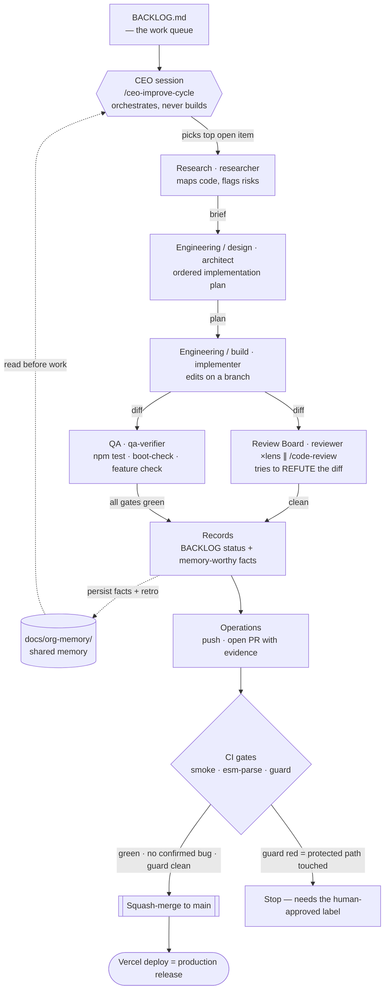
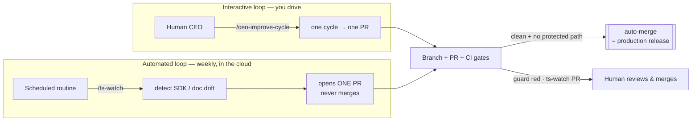

# ThoughtSpot Embed Playground

A small, shareable tool for testing the **ThoughtSpot Visual Embed SDK**. Point it at any instance,
pick an embed type, tweak the options, and copy the runnable SDK code. No build step, no framework.

> **One job:** connect → pick an embed → tweak → copy the code. Every setup is a shareable link.

---

## Quick start (≈30 seconds)

You need **Node 18+** and a ThoughtSpot instance you can log into.

```bash
npm install
npm start
```

Open **http://localhost:3000**, paste your instance URL in the top bar, and click **Connect**.
That's it — no `.env`, no keys. This uses **browser-session auth**: keep a tab logged into your
ThoughtSpot open in the same browser and the playground rides that session.

> **One-time CORS step:** for the object pickers to load, add `http://localhost:3000` to your
> instance's CORS allowlist (**Develop → Customizations → Security Settings → CORS**). The embed
> itself renders even without this — only the REST-driven dropdowns need it.

Then:
1. Pick an embed from the left rail.
2. Choose a data object in the inspector's **Data object** section.
3. Tweak options on the right; watch the **SDK Code** tab at the bottom build itself; click **Copy**.

---

## Trusted Auth (optional)

Want to test trusted-auth tokens, groups, JIT, and RLS claims? Four steps:

```bash
# 1. In ThoughtSpot (admin): Develop → Customizations → Security Settings → Trusted authentication
#    → enable it and copy the secret key.

# 2. Create and edit .env:
npm run setup                 # creates .env (won't overwrite an existing one)
#    set THOUGHTSPOT_HOST, TS_SECRET_KEY, and TS_DEFAULT_USERNAME (your TS username)

# 3. Verify it works BEFORE opening the browser — this mints a real test token:
npm run doctor

# 4. Start (restart if it was already running — .env is read at boot):
npm start
```

`npm run doctor` checks your `.env`, confirms the instance is reachable, and mints a short-lived
token for the default user — so you get a clear ✓ or the exact upstream error (bad secret, unknown
user, …) instead of debugging it through the UI.

Then switch the top-bar auth selector to **Trusted token** and click **Token claims…**. The Node
server holds the `secret_key` and mints short-lived tokens — **the secret never reaches the browser.**
The live inspector shows the redacted request, the raw token, decoded JWT claims, an expiry
countdown, and every `getAuthToken` call (including silent `autoLogin` refreshes). **Mint & apply**
switches the embed to `AuthType.TrustedAuthTokenCookieless` using your claims.

Pick a **token type** in the claims panel — it selects the mint endpoint and the ABAC surface:

- **full** → `auth/token/full` (default, plain trusted auth):
  - **Identity & JIT** — `username`, `auto_create`, `display_name`, `email`, `org_id`, validity
  - **Groups** (`group_identifiers[]`) — group-keyed RLS/ABAC (the durable path)
  - **ABAC / RLS** (`user_parameters`) — `runtime_filters[]`, `runtime_sorts[]`, `parameters[]`
    *(deprecated in TS 10.4.0.cl+; surfaced for testing)*
- **custom** → `auth/token/custom` (ABAC via RLS — the forward track):
  - **`variable_values[]`** — `{ name, values }` where `name` is a formula variable referenced in an
    RLS rule via `ts_var(name)`. The modern replacement for `user_parameters`.
  - **`persist_option`** — a **required** field on this endpoint (enum `REPLACE`/`APPEND`/`NONE`/`RESET`,
    no server default — omit it and the mint returns `400`). The playground sends `REPLACE`, so each
    mint is authoritative and entitlements can't **accumulate** across mints (the risk `APPEND` invites).
    `NONE`/`RESET` are rejected when `variable_values` are present.
  - **`objects[]`** — optional `LOGICAL_TABLE` identifiers to scope the values to specific models.

> Most deployments standardize on **one** mint endpoint (`full` *or* `custom`) for consistency and
> simpler auditing — the picker lets you switch per mint so you can test either. (A hard cluster-wide
> "only one workflow active at a time" restriction couldn't be confirmed against the current API
> reference, so treat a mixed design as unusual rather than impossible.)

> **Runtime filters are not a security boundary.** They become editable URL params; the inspector and
> generated code flag this. For tenant isolation or per-user data, enforce it server-side with RLS/ABAC
> (a `custom` token + `variable_values`).

### `.env` settings

| Key | What it is | Default |
|---|---|---|
| `THOUGHTSPOT_HOST` | Full instance URL | — |
| `TS_SECRET_KEY` | Trusted-auth secret (Develop → Customizations → Security Settings). **Never commit.** | — |
| `TS_DEFAULT_USERNAME` | User minted for when the UI leaves the field blank | `tsadmin` |
| `TS_USERNAME_ALLOWLIST` | Comma-separated usernames the server may mint for | = default user |
| `TS_DEFAULT_ORG_ID` | Optional Org id | — |
| `PORT` | Server + static port | `3000` |
| `TS_ALLOW_JIT` | Allow `auto_create` (JIT). Off blocks provisioning new users that bypass the allowlist | `false` |
| `TS_GROUP_ALLOWLIST` | Groups the browser may request via `group_identifiers`. Empty = none; `*` = any | empty |
| `TS_ALLOW_DEV_PROXY` | Enable the `/api/writeback` stub sink | `false` |

> **Heads-up:** the guards are **fail-closed**. To exercise the full claims playground (arbitrary
> groups + JIT), set `TS_ALLOW_JIT=true` and `TS_GROUP_ALLOWLIST=*` in `.env`. See
> [Security model](#security-model) for why these default off.

---

## Sharing

Everything you configure (host, embed, object GUIDs, every applied option, auth claims) is encoded
into the **URL hash** and saved to `localStorage`. Click **Share** to copy a link that reproduces
your exact setup on someone else's machine. **Secrets are never serialized** — no token or
`secret_key` is ever in the link. Links are sanitized on load, and a host that arrives via a shared
link asks for an explicit **Connect** click before the app touches it.

---

## Embed types

| Rail item | SDK class | Needs |
|---|---|---|
| Search Data | `SearchEmbed` | Worksheet/Model |
| Spotter AI | `SpotterEmbed` | Worksheet/Model |
| Spotter Chat (MCP) | Spotter 3 **MCP** session relayed over SSE — your own chat UI, no iframe and no SDK; runs as you (see [docs](docs/spotter-mcp-chat.md)) | — (optional Worksheet/Model) |
| Liveboard | `LiveboardEmbed` | Liveboard |
| Custom Liveboard | `LiveboardEmbed` + website-native filter bar | Liveboard |
| AI Highlights | `LiveboardEmbed` + `HostEvent.AIHighlights` (auto-fired on render) | Liveboard |
| Single Viz | `LiveboardEmbed` (+`vizId`) | Liveboard + Viz, or a standalone Answer |
| Full App | `AppEmbed` | — |
| AI Insights (REST) | Spotter REST (`/ai/relevant-questions/` + `/ai/answer/create` + `/searchdata`) — auto-generates insights with inline data tables, no iframe | Worksheet/Model |

**The inspector** is contextual to the active embed — only relevant sections show: Data object ·
Display options · Modify actions · Runtime filters (live) · Runtime parameters · Custom actions ·
Host events · Custom styles.

**The bottom panel** has four tabs: **Event Log**, **SDK Code** (a runnable snippet that updates as
you tweak), **SDK Lifecycle** (the host ↔ iframe ↔ server handshake, live), and **APIs Used** (the
REST + SDK calls this setup touches, lighting up as they fire).

---

## Custom actions

Custom actions add buttons to an embed's menu or context menu. The inspector's **Custom actions**
section builds them and mirrors each one into the **SDK Code** tab. Pick a **type** per action:

| Type | What fires | What the host does |
|---|---|---|
| **Callback** | `EmbedEvent.CustomAction` with the row payload | Runs your own code in the host — no navigation |
| **URL** | Opens a URL with the selected row data appended | Hands off to another app with context |
| **Write-back** | `POST /api/writeback` (dev-proxy stub) | Round-trips a value to a system of record |
| **Drill-down** | Re-renders at a detail Liveboard | Navigates to a focused board, filters carried over |

Three integrations ship wired up, each with a full write-up in [`docs/`](docs/):

- **Download PDF (Callback)** — a `Callback` action pulls the rows behind a visualization via its
  `answerService` and builds a paginated PDF **client-side** (regional sales statements, one per
  page). No server round-trip; ThoughtSpot never sees the document. The handler lives in
  [js/invoice-pdf.js](js/invoice-pdf.js); the how-and-why is in
  [docs/callback-action.md](docs/callback-action.md).
- **Customize Export (REST Report API)** — a menu action opens *your own* dialog (format, page
  layout, orientation, include/exclude toggles, footer text) and exports the Liveboard through
  `POST /api/rest/2.0/report/liveboard` with the **current active filters baked in** — bypassing
  ThoughtSpot's native Download modal so you control every option (and which ones the user sees).
  See [docs/customize-export.md](docs/customize-export.md).
- **Webhook Inbox (scheduled-Liveboard deliveries)** — a fail-closed, multipart-aware receiver
  (`POST /api/webhook`) plus a bottom-panel 🔔 **Webhooks** tab that shows ThoughtSpot's **recipient
  batching** and lets you **download each recipient's actual report** to see what their row-level
  security produced (external batched into one webhook, each internal user in its own, groups
  expanded, RLS-blocked users skipped). Schedule one with `npm run schedule-liveboard`, trigger it
  with Send now, or rehearse locally with `npm run simulate-webhook -- --multipart`. Full walkthrough
  in [docs/webhook-inbox-demo.md](docs/webhook-inbox-demo.md).
- **Spotter Chat (MCP)** — a rail section (under *Search & AI*) that is **your own chat UI** over
  ThoughtSpot's **Spotter 3 MCP server**: no Visual Embed SDK, no LLM in the loop. The server relays
  `create_analysis_session → send_session_message → get_session_updates` and streams the result back
  as SSE, while a **text-customization layer** rewrites vendor terms in the prose ("Spotter" →
  "DataAnalyzer") without ever touching URLs or the answer `iframe_url`. **Nothing to configure** —
  the relay forwards the credential from your current connection (trusted auth, or the token behind
  your browser session via `auth/session/token`) and never mints, so Spotter runs as the real end
  user and their RLS applies. Code in [lib/spotter-mcp/](lib/spotter-mcp/) +
  [js/spotter-mcp.js](js/spotter-mcp.js); the swappable label map is
  [lib/spotter-mcp/labels.json](lib/spotter-mcp/labels.json).

---

## Commands

| Command | What it does |
|---|---|
| `npm start` | Run the server + frontend on `http://localhost:3000` |
| `npm run dev` | Same, with auto-restart on file changes |
| `npm run setup` | Create `.env` from the template (Trusted Auth) |
| `npm run doctor` | Verify Trusted Auth: check `.env`, reach the instance, mint a test token |
| `npm test` | Boot the server and assert the security guards + static restrictions (**the security gate**) |
| `npm run boot-check` | Boot the app in headless Chrome and fail on any JS error or non-favicon 4xx (**the frontend gate**) |
| `npm run vendor-sdk` | Download a pinned copy of the SDK into `vendor/` to self-host it |
| `npm run register-webhook -- --url=…` | Register the demo webhook on your ThoughtSpot instance (needs a tunnel + admin token) |
| `npm run schedule-liveboard -- --liveboard=… --users=… --emails=…` | Create a Liveboard schedule with a recipient mix, then trigger it with Send now |
| `npm run simulate-webhook -- --multipart` | Rehearse deliveries into the local receiver (see [docs/webhook-inbox-demo.md](docs/webhook-inbox-demo.md)) |

---

## Security model

`TS_SECRET_KEY` lives only on the server, and the guards are **fail-closed**:

- The username **allowlist** blocks impersonating arbitrary *existing* users.
- **JIT (`auto_create`) is refused** unless `TS_ALLOW_JIT=true` — otherwise it side-steps the
  allowlist by provisioning a brand-new user.
- **`group_identifiers` are refused** unless each group is in `TS_GROUP_ALLOWLIST` (or it's `*`) —
  otherwise the browser could mint a token into a privileged group.
- **`/api/filter-values` forwards the caller's own token** and never mints one, so it can't be an
  unauthenticated data-exfiltration proxy.
- **Static serving** is restricted to the frontend assets (never source, `.env`, docs, or bundles).
- **Shared links** are sanitized (unknown keys dropped, types coerced, prototype-pollution blocked),
  and a hash-supplied host requires explicit confirmation before any request is made to it.

`npm test` asserts these stay closed. A real deployment must still derive the username from a
verified server-side session (SSO/cookie), never from the request body. The Visual Embed SDK loads
from a pinned unpkg URL by default; run `npm run vendor-sdk` to self-host it from `/vendor`.

---

## Troubleshooting

| Symptom | Fix |
|---|---|
| Status says **CORS blocked** | Add `http://localhost:3000` to the instance's CORS allowlist (Develop → Customizations → Security Settings). The embed still renders; only the REST pickers need it. |
| **Log in to ThoughtSpot first** | Browser-session auth needs an active login. Open your instance, sign in, then click *retry*. |
| Token mint returns **503** | `TS_SECRET_KEY` isn't set. Run `npm run setup`, fill in `.env`, then `npm run doctor`. |
| Trusted Auth won't mint | Run `npm run doctor` — it pinpoints a bad secret, unknown user, or unreachable host. |
| Minting **403s** for your user | The user isn't allowed. Set `TS_DEFAULT_USERNAME` to your username and leave `TS_USERNAME_ALLOWLIST` blank. |
| JIT / group minting returns **403** | Fail-closed by design. Set `TS_ALLOW_JIT=true` and/or `TS_GROUP_ALLOWLIST=…` in `.env`. |
| Edited `.env` but nothing changed | `.env` is read at boot — restart `npm start`. |
| `file://` doesn't work | Serve it — `npm start` (or VS Code Live Server → `http://localhost:5500`). |

---

## Files

```
index.html        Tool shell (top bar · rail · stage · inspector). JS-rendered panels.
config.js         Optional seed defaults (you rarely touch this).
css/styles.css    Design system + tool layout.
js/
  state.js        Single state object → URL-hash + localStorage + share link (sanitized on load).
  discovery.js    REST discovery: org, worksheets, liveboards, vizzes, answers.
  embed.js        Visual Embed SDK wrapper: initSDK() + doRender().
  auth.js         Trusted-auth token-claims playground + live inspector.
  invoice-pdf.js  Callback-action handler: viz rows → paginated, client-side PDF (sales statements).
  app.js          Controller: connection, rail, render, inspector, SDK code, APIs panel, log.
server.js         Token service (mints full-access tokens) + filter proxy + static host. Fail-closed.
scripts/          setup.mjs · smoke-test.mjs (npm test) · vendor-sdk.mjs (self-host the SDK).
docs/             Deep-dive guides: callback-action.md (host-code buttons) · customize-export.md (REST Report API export).
misc/             Archived/unused material (old "Vantage Sales" app, repro bundles, snake game). Gitignored.
```

---

## How this project is maintained — the agent org

This repo is maintained by a small **organization of AI agents** (Claude Code sessions) running a
continuous-improvement loop. The design is deliberate: stateless agents share one durable,
in-repo brain, so any session — local, worktree, or the weekly cloud routine — picks up the work
and behaves like the same team. The brain has three stores:

| Store | Holds | Changed by |
|---|---|---|
| [`CLAUDE.md`](CLAUDE.md) | **Rules** — the constitution, critical invariants | Human-approved PRs only (guard-protected) |
| [`BACKLOG.md`](BACKLOG.md) | **Tasks** — the prioritized work queue | Every cycle (Status/notes/new rows only) |
| [`docs/org-memory/`](docs/org-memory/) | **Facts** — verified findings, traps, and the retro log | Every cycle, at the Records step |

Every agent reads the org memory before working and reports **memory-worthy facts** back; the
cycle persists them in the same PR as the work — so knowledge earned once is never re-derived.

**Three standing goals, in priority order:**
1. **Improve the app** — the `S`/`R` backlog items (stability, features, refactors).
2. **Keep it current** — the `W` items: track ThoughtSpot SDK/doc drift.
3. **Improve the org itself** — the `M` items: sharpen the skills, playbooks, and gates.

### The improvement cycle

The **CEO is an orchestrator, not a department**: it picks the work, dispatches the department
agents — **in parallel wherever they have no data dependency** — judges their findings, and
ships. One run of [`/ceo-improve-cycle`](.claude/skills/ceo-improve-cycle/SKILL.md) takes the top
open backlog item through every department and ships one verified PR:



Review Board and QA read the same diff **concurrently** (the reviewer lenses each run as their own
parallel agent); when `/ceo-improve-cycle N` picks independent items, their build→QA phases run in
**parallel git worktrees**, one branch and PR per item.

At a glance — the CEO orchestrates the departments, dispatching them in parallel wherever they have
no data dependency (Review Board ∥ QA on one diff; every reviewer/hunter lens its own agent):

```
Human CEO ── sets priorities in BACKLOG.md
    │
CEO session ── /ceo-improve-cycle · orchestrates, never builds
    │  reads docs/org-memory/ first, then dispatches (in parallel where independent)
    │
    ├─ researcher     Research & Intelligence   read-only   maps the code, flags risks
    ├─ architect      Engineering · design      read-only   writes the implementation plan
    ├─ implementer    Engineering · build       BUILDS      edits on a branch (worktree-isolated)
    ├─ reviewer       Review Board              read-only   refutes the diff — 1 agent / lens
    ├─ bug-hunter     Discovery                 read-only   hunts NEW bugs — 1 hunter / lens
    ├─ qa-verifier    QA                        read-only   npm test · boot-check · feature check
    └─ Operations     gh · /schedule · /loop    ships       opens the PR, merges only when gates green
```

Each department is a **named agent** in [`.claude/agents/`](.claude/agents/), dispatched by the CEO
with a read-only or build-scoped toolset:

| Department | Agent | Role |
|---|---|---|
| Research & Intelligence | `researcher` | Maps the exact files, functions, and call sites the item touches; surfaces reusable helpers and risks. **Read-only.** |
| Engineering — design | `architect` | Turns the brief into a concrete, ordered implementation plan. **Read-only.** |
| Engineering — build | `implementer` | Executes the plan on a branch (worktree-isolated for parallel work) and runs the gates. |
| Review Board | `reviewer` + `/code-review` | Adversarial: tries to **refute** the diff — one parallel agent per lens (correctness / security / regression). |
| Discovery | `bug-hunter` | Hunts an assigned area for **new** bugs, one parallel hunter per lens; every finding needs a concrete failure scenario. |
| QA | `qa-verifier` | Runs the full verification bar — `npm test`, `npm run boot-check`, ESM parse — plus a feature-specific check. |
| Operations | `gh`, `/schedule`, `/loop` | Opens the PR with an evidence section, watches CI, and merges only when every gate is green. |

### Bug hunting — the org restocks its own queue

`/ceo-improve-cycle discover` fans out parallel `bug-hunter` agents over a chosen hunting ground,
dedupes and re-verifies their findings, and files the survivors as backlog rows.
`/ceo-improve-cycle discover fix` then chains straight into fixing them — each confirmed finding
gets its own research→build→review→QA cycle and its own PR (parallel worktrees when the fixes
don't overlap). Finding and fixing never share a diff, so every PR stays small and reviewable.

### Guardrails — what keeps autonomous agents safe

- **Every change is a branch + PR** with a verification-evidence section — never a direct commit to `main`.
- **Merging `main` deploys to production via Vercel** — every merge is treated as a release.
- **CI gates** ([`.github/workflows/ci.yml`](.github/workflows/ci.yml)): `smoke` (security guards),
  `esm-parse` (every module parses as a browser ES module), and `guard` (protected paths) are
  **required**; `boot` (headless frontend) is advisory until it proves stable.
- **Protected paths are mechanically enforced.** Any PR touching `server.js`, `js/state.js`,
  `scripts/smoke-test.mjs`, `.env*`, `.github/workflows/*`, or `CLAUDE.md` fails the `guard` job
  until a **human** adds the `human-approved` label. Agents may never add that label, never
  `--admin`-merge, and never weaken the guard.
- **A PR auto-merges only when** every required check is green **and** review found no confirmed
  correctness bug **and** the `guard` check passed without needing a human label.

### Two operating loops



The **interactive** loop is you, the human CEO, running `/ceo-improve-cycle`. The **automated** loop
is a weekly cloud routine that runs [`/ts-watch`](.claude/skills/ts-watch/SKILL.md) to catch
ThoughtSpot SDK/doc drift — it opens exactly one reviewable PR and **never merges**. Both converge
on the same branch → PR → CI gates. A cycle PR that is fully green and touches no protected path
**auto-merges — and every merge is a production release**; ts-watch PRs and anything the `guard`
job flags always wait for a human.
